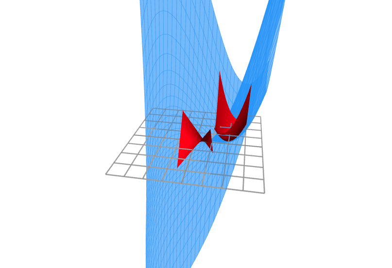

Second Partial Derivative Test Visualization
===

Demonstrates how the second partial derivative test uses a local Hessian approximation of the
function to determine the type of the critical point.
